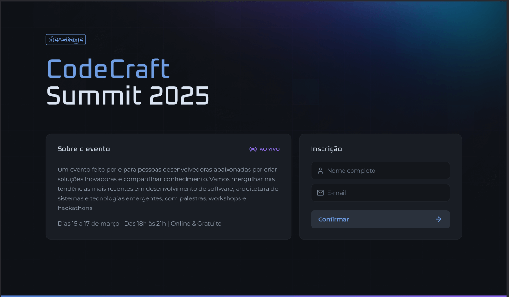
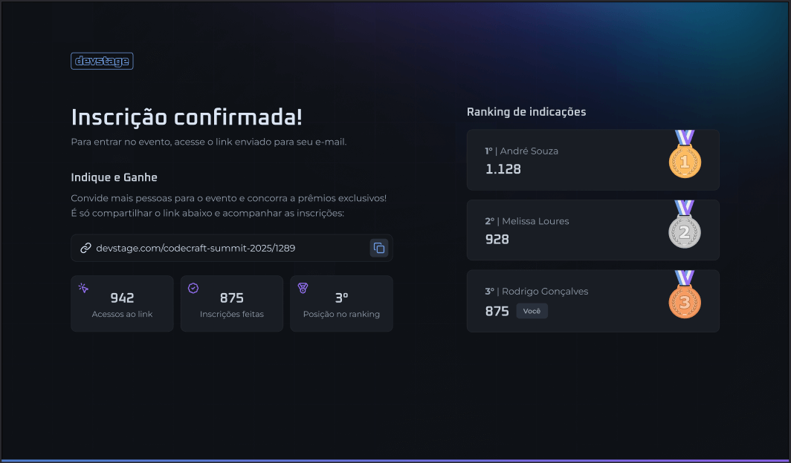
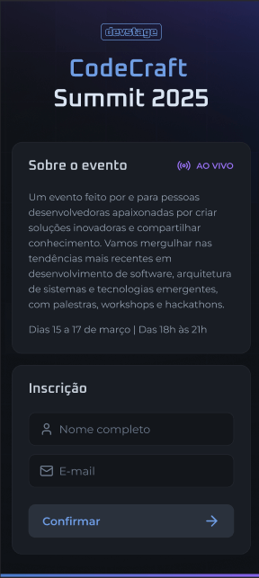
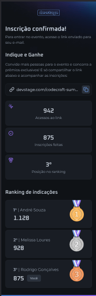

<p align="center">
  
</p>

<h1 align="center">DevStage — Event Referral System</h1>

DevStage is a full application that implements an **event subscription and referral system**.  
It allows people to register for an event, share personal invite links, and compete on a leaderboard based on successful referrals.

This monorepo contains:

- **[`server/`](./server/README.md)** → Backend API built with **Node.js, Fastify, PostgreSQL, Redis, Drizzle ORM, TypeScript**  
- **[`web/`](./web/README.md)** → Frontend app built with **Next.js, React.js, Tailwind CSS, TypeScript**  

---

## 🎯 Features

### Backend

- Subscribe to an event with **duplicate email handling**  
- Track **invite link clicks** (Redis)  
- Track **successful referrals** (Redis sorted set)  
- Show **leaderboard** with top referrers  
- Swagger auto-docs at `/docs`

### Frontend

- Landing page with **event details** + **signup form**  
- Referral page with:
  - Personalized **invite link** (copy to clipboard)  
  - **Stats**: clicks, referrals, ranking position  
  - **Leaderboard** with medals for top 3

### Tech Stack

- **Backend**: Node, Fastify, TypeScript, Drizzle ORM, PostgreSQL, Redis, Swagger, Zod  
- **Frontend**: Next.js (App Router), React, TypeScript, Tailwind CSS, React Hook Form, Zod, Orval  
- **Infra**: Docker, PostgreSQL, Redis


---

## 🏗️ Project Structure

```
dev.stage/
├── server/         # Backend API
│   ├── src/
│   │   ├── database/   # Drizzle schema & migrations
│   │   ├── redis/      # Redis connection
│   │   ├── routes/     # Fastify routes (REST API)
│   │   ├── usecases/   # Business logic
│   │   ├── env.ts      # Read environment variables
│   │   └── server.ts   # Fastify server entry
│   └── tools/          # Docker Compose, API test file
│
├── web/            # Frontend App
│   ├── src/
│   │   ├── app/        # Next.js app router pages
│   │   ├── assets/     # Page logo and icons
│   │   ├── http/       # API client functions
│   │   └── components/ # Shared UI components
│   └── public/         # Static files
│
├── docs/           # Project layout images
└── README.md       # Project documentation
```

---

## 🖌️ Layout

### 💻 Desktop

<div align="center">
  
  
</div>

### 📱 Mobile

<div align="center">
  
  
</div>

---

## 📜 License

This project is licensed under the **BSD 3-Clause License**.

---

## 👤 Author

[**@th92rodr**](https://github.com/th92rodr)
